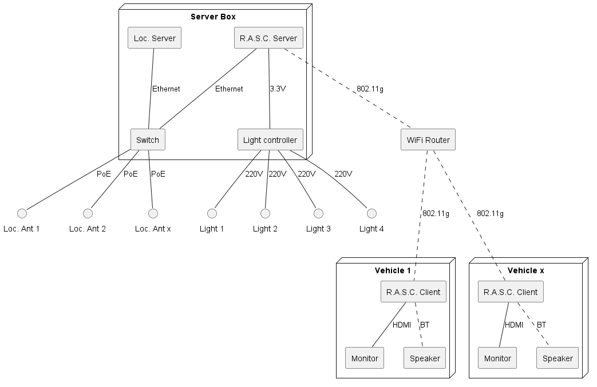

# RASCA: Real-time Alert and Safety Collision Avoidance

RASCA is an advanced safety and collision avoidance system designed for warehouse vehicles that operate on pedestrian pathways to transport cargo. The system provides real-time alerts, automatic braking, and auditory notifications to ensure the safety of both drivers and pedestrians.

## Features

- **Real-time Localization**: Monitors the positions of vehicles and pedestrians within the warehouse.
- **Proximity Alerts**: Shows distance and direction of incoming vehicles to drivers and activates warning lights for pedestrians.
- **Collision Warnings**: Alerts drivers when another vehicle is too close and identifies its direction of approach.
- **Automatic Braking**: Engages electrical brakes to stop the vehicle if a collision is imminent.
- **Pedestrian Way Alerts**: Projects roof lights to warn pedestrians when a vehicle is approaching on a pedestrian pathway.
- **Auditory Alerts**: BT speakers on each vehicle play alerts in real language using eSpeak.
- **Configurable Alerts**: Allows vehicle-specific adjustments, such as setting the distance thresholds for alerts.

## How It Works

1. **Data Transmission and Processing**:
   - The **Raspberry Pi server** receives data from the localization system and performs real-time calculations to determine which alerts to activate and sends data with vectors for each vehicle through a **Mosquitto broker**.
2. **Vehicle Communication**:
   - Each vehicle is equipped with a **Raspberry Pi** that receives data from the server, displays the user interface using **Node-RED** on a monitor, and processes braking decisions.
3. **Safety Alerts and Braking**:
   - When nearby vehicles are detected, the system presents their incoming angles and distances to alert the driver. If the distance is dangerously close, the automatic braking system is engaged.
   - If a vehicle is detected on a pedestrian pathway, the system activates roof lights to project warning signs for pedestrians and uses the monitor and BT speakers to issue alerts for the driver.

## System Components

- **Server Box**: The central unit that manages data processing and control, hosting:
  - **Localization Server**: Detects and tracks vehicle and pedestrian positions.
  - **R.A.S.C. Server**: Processes data, calculates distances and vectors, and sends telemetry data to vehicles.
  - **Switch**: Connects the server to various components, enabling data transfer.
  - **Light Controller**: Controls warning lights and signals.
- **Wi-Fi Router**: Facilitates wireless data transmission between the server and the vehicle clients.
- **Vehicle Clients**: Each vehicle is equipped with:
  - **Raspberry Pi Client**: Interfaces with the localization system and processes braking decisions. The system's logic is managed using Node-RED, with additional Python modules for control.
  - **Monitor**: Displays real-time vehicle and safety information to the driver.
  - **BT Speaker**: Plays auditory alerts generated by eSpeak in real language.
- **Localization Antennas**: Antennas connected to the switch, providing Power over Ethernet (PoE) for communication.
- **Warning Lights**: Visual signals that alert pedestrians and drivers about nearby vehicles.
- **Electrical Brakes**: Activated to stop the vehicle when necessary for collision prevention.



## Installation

1. Clone this repository:
   
   ```bash
   git clone https://github.com/HermesDaviskas/rasca.git
   cd rasca
   ```

2. Install required dependencies (add installation steps as needed).

3. Connect and configure hardware components according to the system diagram (to be included).

## Configuration

- Adjust the alert distance thresholds for each vehicle through the Node-RED interface.

## Future Improvements

- Integration with advanced sensors for improved pedestrian detection.
- Enhanced configuration options for fleet-wide settings.
- Expansion for use in larger warehouse operations with more complex routing.

## License

This project is licensed under the MIT License. See the LICENSE file for details.

## Contact

For questions or support, please contact:
Hermes Daviskas
Email: hermes.daviskas@gmail.com
